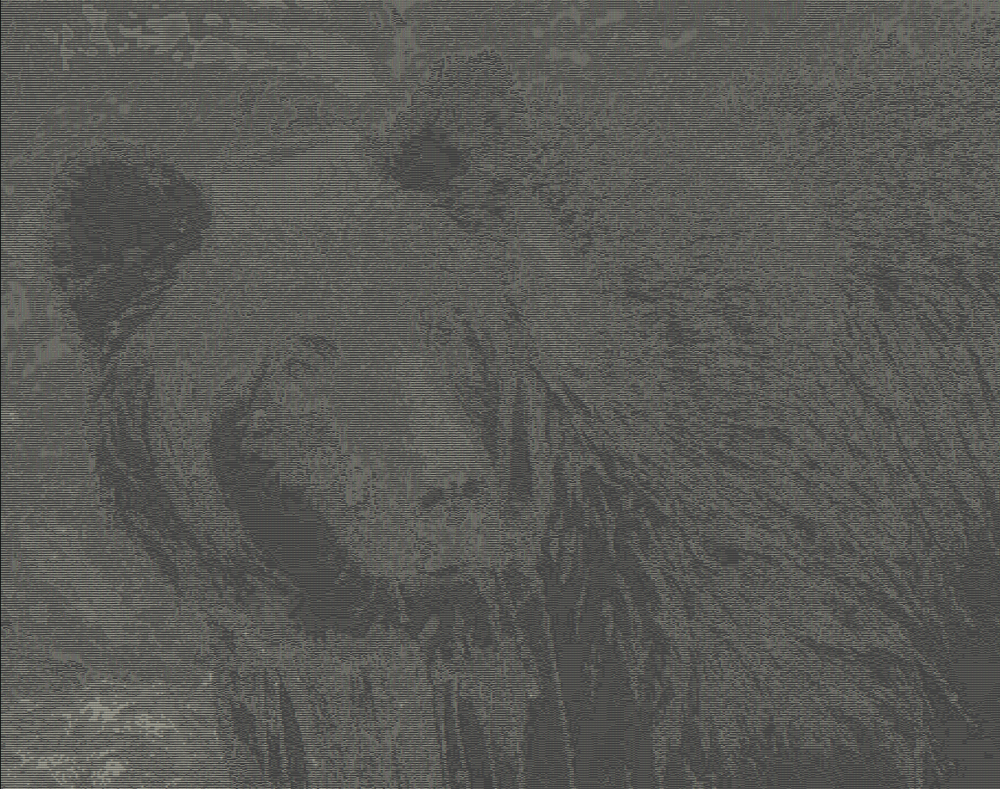
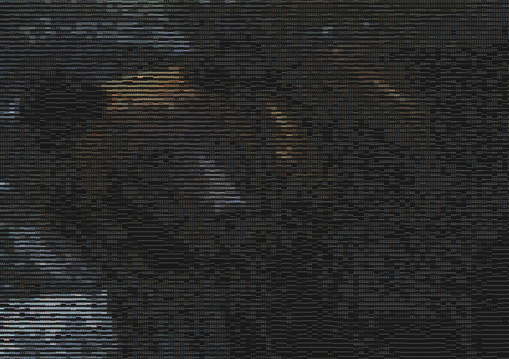

# ascii-art-in-python

A simple Python converter for generating and displaying ASCII art in your terminal. Give it a photo or image filename (in code), and it will turn it into ASCII art, which you can view in your terminal (optionally in color) or save to a file—your choice is made from the main function!

## Features

- **Image-to-ASCII art converter:** Input any image filename in the code and see it as ASCII art
- Choose output: show ASCII art in the terminal (with optional color), or save to a file
- Optionally display ASCII art in color (**color only works in terminal**)
- Save ASCII art output to a file

## Installation

1. **Clone the repository:**
   ```sh
   git clone https://github.com/TheSebitzu/ascii-art-in-python.git
   cd ascii-art-in-python
   ```

2. **Install requirements:**
   This program uses Python’s standard library and the Pillow library.
   ```sh
   pip install pillow
   ```

## Usage

1. **Set the image filename**  
   Open the code (for example, `ascii_art.py`) and set the image filename you want to convert to ASCII art, e.g.:
   ```python
   open_image(path="...")
   ```

2. **Choose output mode in `main`**  
   In the `main` function, choose whether to output the ASCII art to the terminal (optionally in color) or to a file, using the `write_to_file` function.

3. **Run the program:**
   ```sh
   python ascii_art.py
   ```

- If you choose terminal output, ASCII art will print directly to the terminal.
- If you choose color, the art will be colorized (works only in compatible terminals).
- If you choose file output, an `output.txt` file with the ASCII art will be created.

## How It Works

- The program reads the image file set in the code.
- Pillow (`PIL`) is used to load and process the image into ASCII characters.
- You control (via the main function) whether the ASCII art is printed to the terminal (plain or color), or saved to a file.

## Screenshots

| Initial Image | ASCII Art | ASCII Art (Color) |
|---------------|-----------|-------------------|
|  |  |  |

## Limitations

- **Color output:** Colorized ASCII art only works in compatible terminals.
- **No color in non-terminal environments:** If you run the program in a non-terminal environment, color output will not display.
- **Requires Pillow for image-to-ASCII conversion.**
- **Single-user, interactive:** No batch processing.
- **Image filename is set in the code:** You must edit the script to change the image being converted.

## Requirements

- Python 3.x
- [Pillow (PIL)](https://python-pillow.org) library (`pip install pillow`)

## License

This project is licensed under the MIT License.

---

*Made by [TheSebitzu](https://github.com/TheSebitzu)*